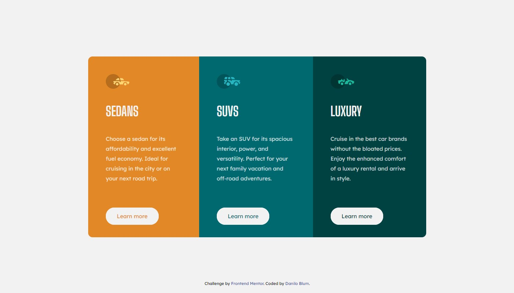
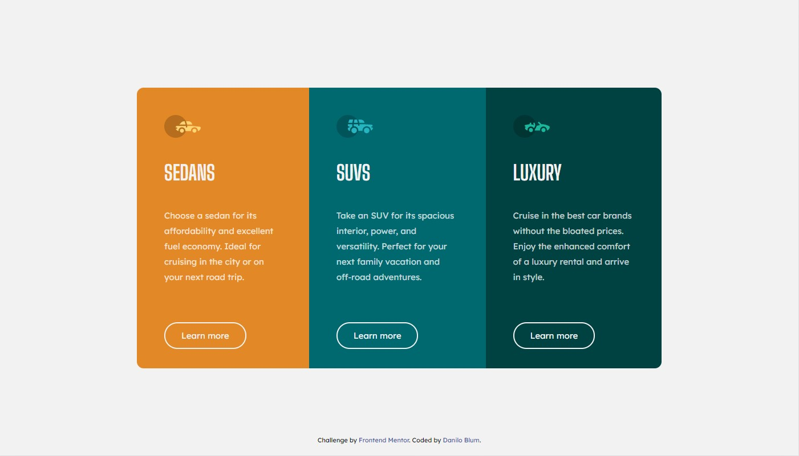

# Frontend Mentor - 3-column preview card component solution

This is a solution to the [3-column preview card component challenge on Frontend Mentor](https://www.frontendmentor.io/challenges/3column-preview-card-component-pH92eAR2-). Frontend Mentor challenges help you improve your coding skills by building realistic projects. 

## Table of contents

- [Overview](#overview)
  - [The challenge](#the-challenge)
  - [Screenshot](#screenshot)
  - [Links](#links)
- [My process](#my-process)
  - [Built with](#built-with)
- [Author](#author)

## Overview

### The challenge

Your challenge is to build out this 3-column preview card component.

Users should be able to:

- View the optimal layout depending on their device's screen size
- See hover states for interactive elements

### Screenshot

### Links

- Solution URL: [Live solution](https://daniloblum.github.io/frontendmentor/newbie/2-3-column-preview-card-component-main/index.html)

## My process

I measured in Photoshop the sizes, paddings, etc. Then, in VS Code I used SASS to build the styles and wrote with mobile first.
I created 2 classes for the border-radius with ":fisrt-child" and ":last-child", so you can delete or insert other types of vehicles and don´t need to ajust the border-radius.

### Built with

- Semantic HTML5 markup
- SASS
- Flexbox
- Mobile-first workflow

## Author

- Frontend Mentor - [@daniloblum](https://www.frontendmentor.io/profile/daniloblum)
- Twitter - [@danilo_blum](https://twitter.com/danilo_blum)
- Behance - [daniloblum](https://www.behance.net/daniloblum)
